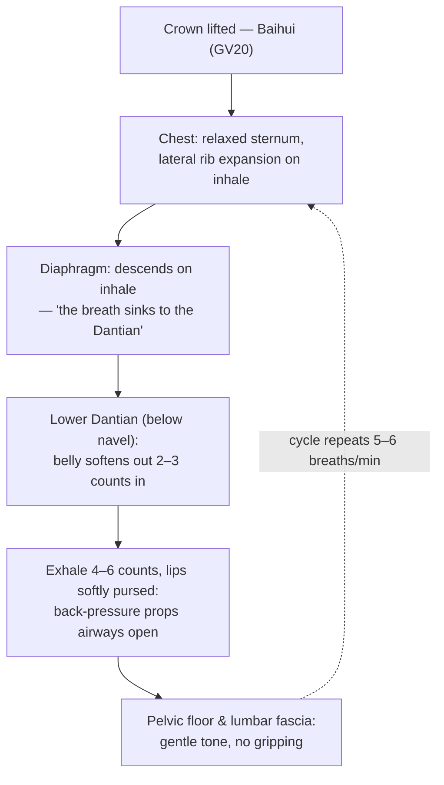

# EN-068: COPD and Asthma Rehabilitation Exercises Through Qigong

> **Vault Grounding**: Integrated from the [Health, TCM, Energy Medicine, Yoga, Taichi and Qigong Vault](https://notebooklm.google.com/notebook/d2401afd-0718-4fac-b429-5bca391d27a9) (299 Sources).

---

## 1. Executive Summary & Clinical Intent

Chronic obstructive pulmonary disease (COPD) and asthma share a central functional problem: the airways resist expiratory flow, the lungs hyperinflate, the diaphragm flattens and loses mechanical advantage, and the accessory muscles of the neck and chest wall take over a job they were never designed to do. The result is a vicious circle — more effort, less air, more anxiety, shallower breathing, worse hyperinflation. Pulmonary rehabilitation is the single best-evidenced non-pharmacological intervention for breaking that circle, and slow, breath-led mind–body exercise sits squarely inside the rehabilitation toolbox.

**What the evidence says, in brief.** Randomized trials and systematic reviews of Qigong and Tai Chi in COPD consistently report improvements in the six-minute walk distance (6MWD) — the field-standard functional capacity measure — typically in the range of 20–50 meters, which exceeds the widely cited minimal clinically important difference (MCID) of ~30 meters when programs run 12 weeks or longer. Trials also report reduced dyspnea on the Borg and modified Medical Research Council (mMRC) scales, improved quality-of-life scores (SGRQ, CAT), and better oxygen saturation stability during exertion. For asthma, the evidence base is smaller but directionally consistent: breath-training and mind–body programs reduce asthma symptom scores, improve quality of life, and — critically — show no evidence of harm when performed at moderate intensity.

**What Qigong actually contributes.** Qigong is not a bronchodilator and this article never frames it as one. Its rehabilitation value comes from four trainable mechanisms:

1. **Breathing-pattern re-education** — replacing accessory-muscle, chest-dominant, high-rate breathing with diaphragmatic, low-rate, extended-exhalation breathing.
2. **Expiratory airway stabilization** — extended pursed-lip-style exhalation generates a small positive airway pressure that delays small-airway collapse, reducing air trapping.
3. **Deconditioning reversal** — slow, graded, whole-body movement rebuilds peripheral muscle capacity without provoking the ventilatory demand that makes conventional exercise intolerable.
4. **Autonomic down-regulation** — slow breathing with long exhalations raises vagal tone, which reduces the anxiety–dyspnea spiral that dominates both diseases.

**Clinical intent in one sentence**: use Qigong as a structured, safe, adjunctive pulmonary-rehabilitation practice — alongside, never instead of, prescribed inhalers and physician-directed care — to measurably improve walking distance, breathlessness tolerance, and quality of life while reducing exacerbation-anxiety.

**Positioning — adjunct, not replacement.** Every claim in this article operates under one governing rule: controller and rescue medications, action plans for exacerbations, and vaccination schedules are the physician's territory. Qigong occupies the space pulmonary rehabilitation guidelines reserve for exercise training, breathing retraining, and psychosocial support. Patients who stop medication because a breathing practice "feels like it is working" are committing the most dangerous error available in this domain; Section 5 makes this a hard safety line.

---

## 2. Classical TCM & Energy Medicine Theory

### 2.1 The Lung as the "Minister of Regulating Breath" (相傅之官)

In the classical organ system, the Lung (Fei, 肺) is the *Zhi Fu* — the "Minister of Regulating Breath" — the official who sets the tempo at which every other organ receives its supply of Qi. The *Huangdi Neijing* (Suwen, Chapter 5) states: "The Lung is the source of all Qi" (*Fei zhu qi*, 肺主氣) and "the Lung governs the hundred vessels" (*Fei chao bai mai*, 肺朝百脈), meaning that the rhythm established at the breath governs the circulation of the whole system. Two additional classical functions matter directly for respiratory rehabilitation:

- **Fei Zhu Su Jiang (肺主肅降)** — "the Lung governs descending and clearing." Healthy breathing is described as a down-flowing movement; when the Lung's descending function fails, Qi rushes upward, manifesting as cough, wheeze, chest tightness — the exact phenomenology of asthma and COPD. The rehabilitation goal in classical terms is *restoring the descending movement*: long, soft, downward-directed exhalations.
- **Fei Zhu Pi Mao (肺主皮毛)** — "the Lung governs the skin and body hair." The Lung's defensive Qi (*Wei Qi*, 衛氣) forms the body's outer barrier; weak Wei Qi is the classical explanation for the weather-trigger, infection-trigger, and allergen-sensitivity patterns that dominate both diseases.

### 2.2 External Pathogens and the Defensive Layer

Classical etiology for wheezing disorders (*Xiao Bing*, 哮病) and breathlessness (*Chuan Zheng*, 喘證) names the same triggers modern pulmonology does, framed as external pathogenic factors invading a weakened defensive surface: Wind-Cold (viral infection, cold air — today's classic exercise-induced bronchoconstriction trigger), Wind-Heat (infective exacerbation with fever), and — in the chronic phase — Phlegm (*Tan*, 痰) retention, the classical correlate of mucus hypersecretion and airway remodeling. The classical distinction between *Xiao* (whistling wheeze) and *Chuan* (breathlessness) maps cleanly onto asthma versus COPD-dominant dyspnea.

### 2.3 The Kidney's Role: Grasping the Qi

The deepest classical insight for chronic respiratory rehabilitation is that the Kidney (Shen, 腎) "grasps the Qi" (*Na Qi*, 納氣) descending from the Lung. In modern terms, this is the diaphragm–pelvic-floor pressure system and the endurance of the deep postural musculature. A patient who can inhale but "cannot hold the breath down" — inhalation feels shallow and high even when the airway is open — is described classically as Kidney not receiving Qi, and this exactly matches the flattened-diaphragm, dysfunctional-pressure-gradient picture of advanced COPD. The Section 4 drill therefore trains the descending breath into the lower abdomen (*Lower Dantian*, 下丹田) deliberately, and the Six Healing Sounds section uses the "Xu" and "Si" sounds to extend and direct the exhalation.

### 2.4 Why Qigong Is the Classical Rehab Vehicle

Daoyin (導引) — the classical ancestor of Qigong, "guiding and stretching" — appears in the Mawangdui silk scrolls (168 BCE) as a codified system of breath-guided movement for illness, and the *Zhuangzi* describes practitioners "guiding the breath deep and long." The classical prescription logic is identical to modern pulmonary rehabilitation logic: breathe deeper and slower, move continuously but below the ventilatory ceiling, practice daily, and let the pattern consolidate over months. Qigong simply carries the prescription in a form the body can sustain for decades.

---

## 3. Modern Biomechanics & Neurophysiology

### 3.1 The Hyperinflation Problem and Pursed-Lip Breathing

In obstructive disease, narrowed airways close prematurely during exhalation, trapping air. The trapped volume (*residual volume*) rises, so each new breath starts from a higher lung volume where the diaphragm is already shortened and flattened — a muscle that contracts from a shortened length generates less force and pulls inward rather than downward, paradoxically pulling the lower ribs together. Pursed-lip breathing (PLB) — exhaling through narrowed lips as if blowing through a straw — creates back-pressure in the airways that keeps them propped open during exhalation, extends exhalation time, reduces respiratory rate, and measurably decreases dynamic hyperinflation during exertion. Qigong's extended exhalation with relaxed, slightly pursed lips is a slower, more meditative cousin of the same mechanism; the "Si" and "Xu" healing sounds formalize it as a shaped, extended expiratory flow.

### 3.2 The Diaphragm and the Pressure Cylinder

The trunk is a pressure cylinder bounded by the diaphragm above, the pelvic floor below, the abdominal wall in front, and the spine behind. Efficient breathing distributes pressure across all four walls: inhalation expands the ribcage laterally and posteriorly (the "bucket handle" and "pump handle" motions) while the diaphragm descends and the belly softens outward. Sedentary breathing and dyspnea-driven breathing abandon this distribution and over-rely on scalenes, sternocleidomastoid, and upper trapezius — muscles that fatigue quickly and that elevate the ribcage into the already-overinflated space, worsening the mechanics. Qigong's slow, low-tension movements with attention at the lower abdomen re-train the cylinder: lateral costal expansion, diaphragmatic descent, and relaxed abdominal compliance.

### 3.3 The Vagus, the Anxiety–Dyspnea Spiral, and HRV

Dyspnea is not purely mechanical; it is an interoceptive alarm signal processed in the insula and anterior cingulate, amplified by sympathetic arousal, and quieted by parasympathetic tone. The anxiety–dyspnea spiral — breathlessness triggers fear, fear raises respiratory rate and accessory-muscle recruitment, which worsens breathlessness — is the psychological engine of both diseases. Slow breathing at roughly 5–6 breaths per minute with exhalation longer than inhalation is the most reliable non-pharmacological lever for raising vagal tone (visible as improved heart-rate variability), and meta-analytic work in both COPD and asthma associates breath-training programs with reduced anxiety and symptom scores. Qigong's default breathing rate sits exactly in this window, sustained for 20–30 minutes per session — a dose no isolated breathing exercise replicates.

### 3.4 Peripheral Deconditioning and the Exercise-Training Dose

COPD is, in part, a systemic muscle disease: inflammatory cytokines, deconditioning, and disuse shrink type-I muscle fibers in the limbs, so the periphery extracts oxygen inefficiently and demands more ventilation for the same workload — exertional dyspnea arrives early and patients stop moving, completing the deconditioning circle. Pulmonary rehabilitation works largely by reversing this: 60–80% peak-workload training rebuilds peripheral muscle so ventilatory demand falls at any given activity level. The problem is dose: many severe patients cannot tolerate conventional continuous training. Qigong provides a lower-intensity, interval-like movement dose — continuous but sub-ventilatory-threshold — that trials show still moves 6MWD and quality-of-life measures when practiced regularly, making it the realistic entry dose and the maintenance dose for patients who cannot yet tolerate, or no longer need, harder formats.

### 3.5 Fascial and Proprioceptive Dimensions

Slow, spiraling, whole-body movement loads fascial chains — the thoracolumbar fascia, the lateral line, the anterior ribcage myofascia — in the exact planes that restricted, guarded breathing stiffens. Hydration-dependent fascial gliding improves with slow sustained loading; interoceptive accuracy improves with attention-paced movement. The subjective report of "the chest opening" in Qigong practice has a plausible dual substrate: reduced myofascial stiffness of the chest wall and improved respiratory proprioception, both of which lower the effort-to-breathe perception.

---

## 4. Comprehensive Step-by-Step Movement Breakdown

**Format**: The core drill is a 20–30 minute seated-or-standing sequence designed for obstructive-disease safety — every movement is sub-maximal, every exhale is longer than every inhale, and no phase provokes full expiratory flow limitation. Seated is the default for patients with mMRC ≥ 2 or resting SpO₂ below 92%; standing with support (chair back, wall) is the progression.

**Universal breath rule**: inhale through the nose 2–3 counts, exhale through softly pursed lips 4–6 counts. Never exhale to empty; leave 10–20% of air in the chest. If any phase triggers coughing fits or breath-hold anxiety, shorten the movement range — never shorten the exhalation.

### Phase 0 — Posture and Settling (3 minutes)

1. Sit forward on the chair or stand with feet hip-width. Crown lifted as if hung from a thread, chin slightly tucked, shoulders released down the back.
2. Rest both hands over the lower abdomen, below the navel (Lower Dantian).
3. Breathe 9 cycles at 5–6 breaths/min: belly softens outward on the inhale, draws gently back on the extended exhale. No force. This alone is pulmonary-rehab breathing retraining.

### Phase 1 — Opening the Cylinder (5 minutes)

4. **Lateral rib expansion**: hands rest on the lower side ribs, fingertips touching. Inhale — push the ribs out against the fingertips, feeling them separate. Exhale 6 counts through pursed lips, ribs drawing back. 6 repetitions.
5. **Arm arcs with the descending breath**: inhale 3 counts as both arms float out and up to shoulder height, palms soft; exhale 6 counts as they sink down the front, palms pressing lightly toward the Dantian. The arms must never rise above the shoulders — overhead positions compress an already-short diaphragm. 8 repetitions.
6. **Torso spiral**: inhale turning gently to the left from the waist; exhale 6 counts returning to center, then continuing slightly past it to the right. Alternate. 6 per side. This mobilizes the thoracolumbar fascia and the posterior ribcage, the least-used breathing surface.

### Phase 2 — The Six Healing Sounds, Respiratory Edition (6 minutes)

7. **"Si" sound (肺 — Lung)**: inhale 3 counts with arms rising to chest height; exhale 8 counts through teeth nearly closed, tongue against the palate, producing a soft sibilant "sssss" while the palms press down the chest to the lower belly. This is a shaped pursed-lip exhale with acoustic feedback — the sound should be steady, not forced. 6 repetitions.
8. **"Xu" sound (肝 — Liver)**: same structure, exhale 8 counts as "shhhh" with lips relaxed, hands gliding to the lateral ribs. 6 repetitions. The Liver sound releases the frustration-anxiety layer that tightens the upper chest.
9. **"Hu" sound (脾 — Spleen)**: exhale 8 counts as a soft "who," hands circling the lower abdomen. 4 repetitions. Follow with 2 minutes of silent, long-exhale breathing.

### Phase 3 — Whole-Body Qigong Circuit (8–10 minutes)

10. **Wave hands like clouds, seated adaptation**: hands trace slow horizontal circles in front of the chest, weight shifting side to side in the chair; one full breath cycle per half-circle. 2 minutes. Continuous, sub-maximal, exactly the pulmonary-rehab interval profile.
11. **Embracing the tree, seated**: arms hold a soft circle at chest height for 60–90 seconds; breathe the Phase 0 pattern. This is isometric-but-mild training for the postural muscles that hold the ribcage open.
12. **Gathering Qi**: both hands sweep up the centerline on the inhale, down the body on the 6-count exhale, ending stacked over the Dantian. 6 repetitions, then rest the hands and breathe 9 closing cycles.

**Dosage**: daily, 20–30 minutes. Weeks 1–2: Phases 0–1 only. Weeks 3–4: add Phase 2. Week 5 onward: full sequence. Patients completing formal pulmonary rehabilitation use the full sequence as the maintenance dose; patients on the waitlist use it as the entry dose, with the explicit instruction to join a supervised program as soon as one is available.

**Intensity guardrail — the Borg scale.** Rate breathlessness and exertion 0–10 throughout. Target: **Borg 3–4** ("moderate — can still talk in short sentences"). Borg ≥ 6, dizziness, SpO₂ < 88% (for patients with a pulse oximeter), or chest pain: stop, sit, use the rescue plan the physician prescribed. This is not negotiable and is repeated in Section 5.

---

## 5. Common Errors, Kinetic Deviations & Safety Protocols

| Error | Cause | Kinetic & Physiological Fix |
| :--- | :--- | :--- |
| **Long forced exhale to complete emptiness** | Treating exhalation length as a willpower test | Exhale 4–6 counts, leave air in reserve; emptying provokes small-airway collapse and the next inhale becomes gasping |
| **Over-raising the arms above shoulder height** | Copying standing Qigong videos designed for healthy practitioners | Cap all arm paths at shoulder level; overhead positions shorten the diaphragm and spike ventilatory demand |
| **Gulping air between repetitions** | Losing the exhale-longer rule when attention moves to the limbs | Re-anchor to Phase 0 rhythm; one breath per movement phase, never two inhales in a row |
| **Holding the breath during "focus"** | Confusing meditative stillness with breath suspension | Patients with obstructive disease must never practice breath retention; keep the cycle continuous |
| **Neck/shoulder lifting on inhale** | Accessory-muscle dominance | Slide the shoulder blades down; if the shoulders move on the inhale, the drill has reverted to chest breathing — return to Phase 0 |
| **Practicing through an active exacerbation** | "Pushing through" as if it were deconditioning | Suspend the movement phases during infection, fever, or increased sputum; keep only Phase 0 breathing at maximum Borg 2 |
| **Skipping the warm-down** | Stopping abruptly at Borg 3–4 | Abrupt stops cause post-exertional desaturation and bronchospasm in susceptible patients; close with 3 minutes of seated Phase 0 breathing |

**Hard safety protocol — the caution line.**

1. **Medication is never replaced.** Controller inhalers, rescue inhalers, nebulizer schedules, and the written exacerbation action plan remain fully in force. A practice session that "feels like it is working" is not a reason to delay a rescue dose.
2. **Rescue plan first, always.** Wheezing that does not settle, reliever use rising above the physician-defined threshold, fever, purulent sputum, or resting breathlessness worse than the patient's usual baseline: contact the care team — these are exacerbation signals, not training signals.
3. **Stop immediately** for chest pain, dizziness, palpitations, SpO₂ < 88%, confusion, or blue lips/fingertips. Seek emergency care per the action plan.
4. **Environmental triggers.** Cold dry air, high pollen days, and poor air quality provoke bronchoconstriction: practice indoors, pre-warmed room, inhaler within reach. Pre-medicate with the pre-exercise reliever if the physician has prescribed one for exercise.
5. **Contraindications to unsupervised practice**: unstable cardiac disease, recent thoracic/abdominal surgery, untreated pneumothorax history, severe pulmonary hypertension, and any acute exacerbation — these require physician clearance first.
6. **Oxygen patients**: never exceed the prescribed flow; do not disconnect oxygen to "let the practice work."

---

## 6. Anatomical Diagram & Visual Cue Specification



*Figure 6.1: The breathing-pressure cylinder. The trainable loop: lateral rib expansion and diaphragmatic descent on the inhale, extended pursed-lip exhale with back-pressure on the out-breath, everything at 5–6 breaths per minute.*

```html
<svg viewBox="0 0 400 560" xmlns="http://www.w3.org/2000/svg" role="img" aria-label="Breathing cylinder body map">
  <defs>
    <linearGradient id="airflow" x1="0" y1="0" x2="0" y2="1">
      <stop offset="0%" stop-color="#4aa3df"/>
      <stop offset="100%" stop-color="#2e7d32"/>
    </linearGradient>
  </defs>
  <ellipse cx="200" cy="30" rx="26" ry="18" fill="#e8c96a" stroke="#b8933d"/>
  <path d="M200 48 L200 120" stroke="#b8933d" stroke-width="4"/>
  <ellipse cx="200" cy="200" rx="90" ry="95" fill="#f4efe6" stroke="#8d8478" stroke-width="2"/>
  <path d="M170 130 Q200 160 230 130" stroke="#4aa3df" stroke-width="6" fill="none" marker-end="url(#arrow)"/>
  <path d="M140 180 Q200 240 260 180" stroke="#c0754d" stroke-width="5" fill="none" stroke-dasharray="6 4"/>
  <rect x="185" y="150" width="30" height="90" rx="12" fill="url(#airflow)" opacity="0.7"/>
  <ellipse cx="200" cy="330" rx="70" ry="45" fill="#fbe9d0" stroke="#c0754d" stroke-width="2"/>
  <text x="200" y="335" text-anchor="middle" font-size="14" fill="#7a4a1e">Lower Dantian</text>
  <path d="M200 250 Q200 290 200 310" stroke="#4aa3df" stroke-width="6" fill="none" opacity="0.8"/>
  <text x="200" y="425" text-anchor="middle" font-size="13" fill="#2e5d34">Inhale 2–3 counts: ribs widen + diaphragm descends</text>
  <text x="200" y="448" text-anchor="middle" font-size="13" fill="#1e4d6b">Exhale 4–6 counts, pursed lips: airways stay propped open</text>
  <text x="200" y="471" text-anchor="middle" font-size="13" fill="#6b5b3e">Cadence: 5–6 breaths per minute — never hold the breath</text>
  <text x="200" y="520" text-anchor="middle" font-size="12" fill="#8d8478">Figure 6.2 — Breathing-cylinder body map (Respiratory Health 068)</text>
</svg>
```

**SVG spec for site graphics**: seated silhouette with a translucent pressure-cylinder overlay; a blue downward arrow (inhalation: ribs widen, diaphragm descends) and a longer amber upward-outward arrow through the lips (exhalation with back-pressure); a cadence badge reading "5–6 breaths/min" with a pulse-dot animation at 0.8 Hz; a red "never hold the breath" prohibition icon on any breath-retention cue.

---

## 7. Video Demonstration Schema & Slow-Motion Drill Embeds

```html
<div class="video-container" style="position: relative; padding-bottom: 56.25%; height: 0; overflow: hidden; max-width: 100%;">
  <iframe src="https://www.youtube-nocookie.com/embed/Lbyi1l0XwkI"
          title="COPD Asthma Qigong Rehab"
          frameborder="0"
          allow="accelerometer; autoplay; clipboard-write; encrypted-media; gyroscope; picture-in-picture"
          allowfullscreen
          style="position: absolute; top: 0; left: 0; width: 100%; height: 100%;">
  </iframe>
</div>
<p><em>Video: Qigong For Lungs: Acupressure & Breathing For Lung Health (Qigong with Kseny).</em></p>
```

**Slow-motion study guide**: watch at 0.5× speed for three checkpoints — (1) the shoulders must not rise on the inhale (accessory-muscle tell); (2) the exhale must visibly outlast the inhale, lips softly narrowed; (3) the arms never cross above shoulder height. Any of the three failing means the practitioner has drifted back to chest-dominant breathing and should return to Phase 0.

---

## 8. Cross-Disciplinary Synergy

- **General pulmonary rehabilitation**: the sequence slots directly into the breathing-retraining and exercise-training components of a formal program — Phase 0 is pursed-lip diaphragmatic retraining, Phase 3 is the low-intensity continuous movement element, and the Borg target mirrors program intensity prescriptions. The practice is the home dose between supervised sessions.
- **Yoga integration**: the same cylinder mechanics underlie *pranayama*; for obstructive-disease practitioners, substitute this article's exhale-longer rule for any breath-retention (*kumbhaka*) instructions, and favor supported, chest-open, never-full-inversion postures.
- **Tennis and sport cross-training**: the lateral rib-expansion drill raises the ceiling on rotational breathing for overhead sports; the Borg 3–4 discipline is the same sub-threshold aerobic dose that tennis-fitness programs use for recovery days.
- **Senior mobility**: the entire sequence is seated by default — no floor transfers, no fall exposure — making it the natural daily protocol for the frail-respiratory demographic, where walking programs alone fail at the adherence stage.
- **Stress and sleep**: the 5–6 breaths/min cadence doubles as an evening anxiety-down-regulation protocol; patients whose dyspnea is worst at night often benefit most from the Phase 0 + Phase 2 subset before bed.

---

## 9. Self-Assessment Matrix & Progress Metrics

| Symptom / Marker | Indication | Recommended Practice Target |
| :--- | :--- | :--- |
| Talking in single words while walking | Severe exertional dyspnea; deconditioning | Daily full sequence; walking practice paced to Borg 3–4 with the exhale-longer rule |
| Shoulders/neck visibly rise on each inhale | Accessory-muscle dominance | 3× daily Phase 0 (3 min), hands on lower ribs for feedback |
| Exhale shorter than inhale | Air trapping; losing back-pressure | Phase 2 healing sounds 6 reps each; count the exhale out loud |
| Night-time breathlessness or dyspnea-anxiety | Sympathetic dominance; dyspnea spiral | Phase 0 + Phase 2 before bed; 5–6 breaths/min for 5 minutes |
| Practice triggers coughing fits | Exhale forced to empty; airflow too fast | Leave 10–20% air reserve; soften the "Si" sound; slow the movement range |
| Sputum increase with practice | Practice during/reactivating an exacerbation | Suspend movement phases; Phase 0 only at Borg ≤ 2; contact care team if it persists 48 h |

**Progress metrics to track weekly**: (1) six-minute walk distance if a measured corridor is available (target: +25–50 m over 12 weeks, in line with trial means); (2) Borg score during a fixed daily activity (e.g., one flight of stairs) — expect it to fall before 6MWD moves; (3) respiratory rate at rest (target: below 15/min); (4) reliever-inhaler use frequency (report any rise to the care team); (5) restful sleep-onset. All trend data belongs in the shared record the physician sees.

---

## 10. Master Practice Quick-Reference Card (Printable)

> 🎯 **Goal**: Pulmonary-rehabilitation-grade breathing and movement practice in 25 minutes, daily.
> 🧘 **Posture**: Seated forward on a chair (or standing with support); crown lifted, shoulders released, hands over the lower belly.
> ⏱️ **Timing**: Daily, ideally morning; evening subset (Phase 0 + Phase 2) for dyspnea-anxiety. Never during an acute exacerbation.
> 📍 **Anchor Point**: The breath sinking to the Lower Dantian — belly softens out on the inhale, returns gently on the exhale.
> 🔁 **Cadence**: Inhale 2–3 counts (nose) → exhale 4–6 counts (softly pursed lips). 5–6 breaths/min. **Never hold the breath; never exhale to empty.**
> 📊 **Intensity**: Borg 3–4 ("moderate — short sentences still possible"). Stop at Borg ≥ 6, dizziness, chest pain, or SpO₂ < 88%.
> 💊 **Non-negotiable**: inhalers and the physician's action plan stay fully in force — this practice is an adjunct, not a replacement.
> 📞 **Exacerbation signals** (stop practice, contact care team): reliever use above the defined threshold, fever, purulent sputum, resting breathlessness worse than usual.

*Source: Health, TCM, Energy Medicine, Yoga, Taichi & Qigong Vault (299 grounded sources).*
