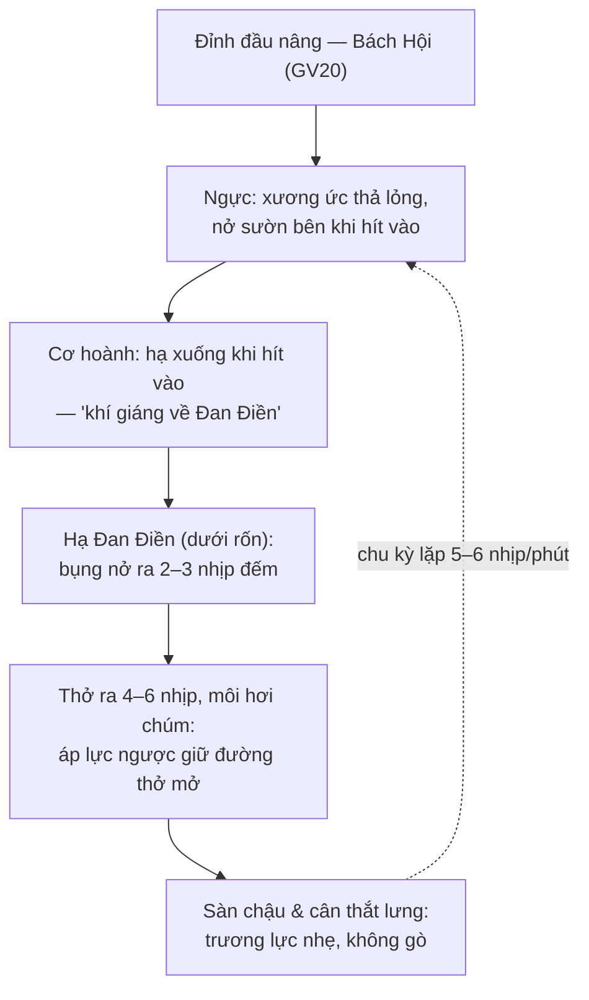

# VI-068: Phục Hồi Hô Hấp Cho Người Hen Suyễn & Hen Phế Quản Nhờ Khí Công

> **Nguồn Tư Liệu**: Trích xuất từ Kho dữ liệu [Health, TCM, Energy Medicine, Yoga, Taichi and Qigong](https://notebooklm.google.com/notebook/d2401afd-0718-4fac-b429-5bca391d27a9) (299 Tác phẩm & Chuyên luận).

---

## 1. Tóm Tắt Điều Hành & Mục Tiêu Trị Liệu

Bệnh phổi tắc nghẽn mạn tính (COPD) và hen suyễn cùng chia sẻ một vấn đề chức năng trung tâm: đường thở cản trở dòng khí thở ra, phế cầu sung máu căng quá mức (hyperinflation), cơ hoành bị làm phẳng và mất lợi thế cơ học, các cơ phụ hô hấp ở cổ và thành ngực phải gánh một công việc chúng không được thiết kế để làm. Kết quả là một vòng xoáy luẩn quẩn — càng gắng sức, càng ít khí, càng lo âu, thở càng nông, sung máu càng nặng. Phục hồi chức năng hô hấp là can thiệp không dùng thuốc được chứng minh tốt nhất cho việc phá vỡ vòng xoáy này, và bài tập thân–tâm chậm dẫn dắt bằng hơi thở nằm ngay trong hộp công cụ của ngành phục hồi đó.

**Bằng chứng nghiên cứu, tóm lược.** Các thử nghiệm ngẫu nhiên và tổng quan hệ thống về Khí Công và Thái Cực Quyền ở bệnh nhân COPD báo cáo nhất quán những cải thiện về quãng đường đi bộ sáu phút (6MWD) — thước đo chức năng chuẩn thực địa — thường trong khoảng 20–50 mét, vượt mức khác biệt tối thiểu có ý nghĩa lâm sàng (MCID) khoảng 30 mét được trích dẫn rộng rãi khi chương trình kéo dài từ 12 tuần trở lên. Các thử nghiệm cũng ghi nhận giảm khó thở theo thang Borg và thang mMRC, cải thiện điểm chất lượng cuộc sống (SGRQ, CAT), và độ bão hòa oxy ổn định hơn khi gắng sức. Với hen suyễn, cơ sở bằng chứng nhỏ hơn nhưng cùng chiều: các chương trình huấn luyện hơi thở và thân–tâm giảm điểm triệu chứng, cải thiện chất lượng cuộc sống, và — điều cốt yếu — không có dấu hiệu gây hại khi thực hiện ở cường độ vừa phải.

**Khí Công đóng góp thực sự điều gì.** Khí Công không phải là thuốc giãn phế quản, và bài viết này tuyệt đối không trình bày nó như vậy. Giá trị phục hồi của nó đến từ bốn cơ chế có thể huấn luyện:

1. **Tái huấn luyện kiểu thở** — thay thế kiểu thở ngực, tần suất cao, lệ thuộc cơ phụ bằng kiểu thở cơ hoành, tần suất thấp, thở ra kéo dài.
2. **Ổn định đường thở thì thở ra** — khí thở ra kéo dài theo kiểu môi chúm tạo áp lực dương nhẹ trong đường thở, làm chậm sập đường thở nhỏ, giảm giữ khí.
3. **Đảo ngược suy giảm thể lực** — vận động toàn thân chậm, tăng dần, tái xây dựng khả năng cơ ngoại vi mà không gây nhu cầu thông khí khiến tập luyện thông thường trở nên không thể chịu đựng.
4. **Điều hòa tự chủ** — thở chậm với thì thở ra dài làm tăng trương lực thần kinh mê tẩu, cắt giảm vòng xoáy lo âu–khó thở chi phối cả hai bệnh.

**Mục tiêu lâm sàng trong một câu**: sử dụng Khí Công như một thực hành phục hồi hô hấp có cấu trúc, an toàn, mang tính bổ trợ — song song, không bao giờ thay thế, thuốc hít theo chỉ định và chăm sóc y tế theo hướng dẫn của bác sĩ — nhằm cải thiện đo lường được quãng đường đi bộ, ngưỡng chịu khó thở và chất lượng cuộc sống, đồng thời giảm lo âu khi cơn kịch phát.

**Định vị — bổ trợ, không thay thế.** Mọi lập luận trong bài vận hành dưới một nguyên tắc bất di bất dịch: thuốc kiểm soát, thuốc cắt cơn, kế hoạch xử trí khi kịch phát và lịch tiêm chủng thuộc thẩm quyền của bác sĩ. Khí Công chiếm khoảng trống mà các hướng dẫn phục hồi hô hấp dành cho huấn luyện thể lực, tái huấn luyện hơi thở và hỗ trợ tâm lý xã hội. Bệnh nhân ngưng thuốc vì "cảm thấy bài thở đang có tác dụng" đang mắc lỗi nguy hiểm nhất trong lĩnh vực này; Mục 5 ấn định đây là ranh giới an toàn cứng.

---

## 2. Lý Luận Đông Y & Y Học Năng Lượng

### 2.1 Phế — "Phó Tướng Điều Độ Hơi Thở" (相傅之官)

Trong hệ thống tạng phủ cổ truyền, Phế (肺) là *Phó tướng* — vị quan điều độ nhịp thở, thiết lập nhịp độ mà mọi tạng khác tiếp nhận Khí. *Hoàng Đế Nội Kinh* (Tố Vấn, chương 5) ghi: "Phế chủ khí" (肺主氣) và "Phế triều bách mạch" (肺朝百脈) — nhịp được thiết lập nơi hơi thở điều khiển tuần hoàn của toàn hệ thống. Ba chức năng cổ truyền liên hệ trực tiếp với phục hồi hô hấp:

- **Phế chủ túc giáng (肺主肅降)** — "Phế chủ giáng và thanh." Hô hấp khỏe mạnh được mô tả là chuyển động đi xuống; khi chức năng giáng của Phế suy, Khí xung ngược lên, biểu hiện thành ho, khò khè, tức ngực — chính là hiện tượng học của hen và COPD. Mục tiêu phục hồi theo thuật ngữ cổ truyền là *khôi phục chuyển động giáng*: thở ra dài, mềm, hướng xuống.
- **Phế chủ bì mao (肺主皮毛)** — "Phế chủ da lông." Vệ Khí (衛氣) của Phế tạo thành rào chắn ngoài cùng của thân thể; Vệ Khí hư nhược là cách Đông Y giải thích cơ chế dị ứng thời tiết, nhiễm trùng và dị nguyên chi phối cả hai bệnh.
- **Phế chủ thông điều thủy đạo** — Phế điều phối sự tiêu thoát của Thủy dịch; tắc trệ ở tầng này sinh Đàm (痰), tương quan cổ truyền của tăng tiết nhầy và tái tạo đường thở.

### 2.2 Ngoại Tà và Tầng Vệ Khí

Bệnh sinh cổ truyền của chứng哮 (khò khè) và喘 (bất lực thở) nêu ra cùng những tác nhân mà hô hấp học hiện đại xác nhận, được diễn giải như ngoại tà xâm nhập bề mặt vệ khí đã suy yếu: Phong Hàn (nhiễm virus, khí lạnh — chính là hình ảnh co thắt phế quản do gắng sức), Phong Nhiệt (kịch phát nhiễm trùng kèm sốt), và — ở giai đoạn mạn — tắc Đàm (痰), tương quan của tăng tiết nhầy và tái cấu trúc đường thở. Phân biệt cổ truyền giữa *Tiêu* (哮, tiếng rít khò khè) và *Xuyến* (喘, khó thở) tương ứng khá rõ với hen suyễn so với khó thở trội do COPD.

### 2.3 Vai Trò của Thận: Nạp Khí

Nhận định sâu nhất của cổ truyền cho phục hồi hô hấp mạn tính là Thận (腎) "nạp khí" (*Nạp Khí*, 納氣) — tiếp nhận khí giáng xuống từ Phế. Theo ngôn ngữ hiện đại, đây là hệ thống áp lực cơ hoành–sàn chậu và sức bền của hệ cơ tư thế sâu. Người bệnh hít được nhưng "không giữ hơi thở xuống được" — hít vào nông và cao dù đường thở còn mở — được mô tả là Thận bất nạp khí, và điều này trùng khớp chính xác với hình ảnh cơ hoành làm phẳng, gradient áp lực rối loạn của COPD giai đoạn muộn. Bài tập ở Mục 4 vì thế huấn luyện hơi thở giáng xuống hạ tiêu (*Hạ Đan Điền*, 下丹田) một cách có chủ đích; phần Lục Chú dùng âm "Tí" và "Hư" để kéo dài và định hướng dòng thở ra.

### 2.4 Vì Sao Khí Công Là Phương Tiện Phục Hồi Cổ Truyền

Đạo dẫn (導引) — tổ tiên cổ của Khí Công, "dẫn kinh và duỗi gân" — xuất hiện trên lụa Mã Vượng Đôi (168 TCN) như một hệ thống mã hóa các chuyển động dẫn hơi thở để trị bệnh, và *Nam Hoa Kinh* mô tả người tập "dẫn hơi thở sâu và dài." Logic prescriptions cổ truyền trùng khớp với logic phục hồi hô hấp hiện đại: thở sâu và chậm hơn, vận động liên tục nhưng dưới ngưỡng thông khí tối đa, tập hằng ngày, và để mẫu hình đi vào ổn định qua nhiều tháng. Khí Công chỉ đơn giản mang đơn thuốc đó trong một hình dạng mà thân thể duy trì được hàng thập kỷ.

---

## 3. Sinh Lý Cơ Học & Thần Kinh Hiện Đại

### 3.1 Vấn Đề Sung Máu và Thở Môi Chúm

Ở bệnh tắc nghẽn, đường thở thu hẹp đóng sớm trong thì thở ra, giữ lại khí. Thể tích giữ lại (thể tích dư) tăng, nên mỗi nhịp hở bắt đầu từ thể tích phổi cao hơn, nơi cơ hoành đã bị rút ngắn và làm phẳng — một cơ co từ chiều dài rút ngắn sinh ít lực hơn và kéo vào trong thay vì kéo xuống, co kéo các xương sườn dưới lại vào nhau. Thở môi chúm (pursed-lip breathing) — thở ra qua môi thu hẹp như thổi qua ống hút — tạo áp lực ngược trong đường thở giúp chúng giữ mở trong thì thở ra, kéo dài thời gian thở ra, giảm tần số hô hấp, và giảm đo lường được sung máu động trong lúc gắng sức. Khí thở ra kéo dài của Khí Công với môi hơi chúm là "người anh em" chậm và thiền định hơn của cùng một cơ chế; các chú Lục Chú hình thức hóa nó thành dòng thở ra có định hình và kéo dài.

### 3.2 Cơ Hoành và Trụ Áp Lực Thân Thể

Thân trên là một trụ áp lực, giới hạn bởi cơ hoành phía trên, sàn chậu phía dưới, thành bụng phía trước và cột sống phía sau. Hô hấp hiệu quả phân bổ áp lực trên cả bốn bức tường: hít vào làm xương sườn nở rộng sang hai bên và ra sau (chuyển động "tay cầm xô" và "tay van") trong khi cơ hoành hạ xuống và bụng mềm ra. Thở ít vận động và thở do khó thở bỏ rơi sự phân bổ này, lệ thuộc quá mức vào cơ ức đòn chũm, cơ thang trên và cơ scalene — những cơ mỏi nhanh và nâng lồng ngực lên đúng khoảng không gian đã bị sung máu, làm cơ học xấu thêm. Chuyển động chậm, ít căng của Khí Công với ý tập trung ở hạ tiêu tái huấn luyện lại trụ áp lực: nở sườn bên, cơ hoành hạ, và thành bụng buông lỏng.

### 3.3 Thần Kinh Mê Tẩu, Vòng Xoáy Lo Âu–Khó Thở và HRV

Khó thở không thuần túy là cơ học; nó là tín hiệu báo động cảm nhận bên trong được xử lý ở đảo insula và vỏ đai trước, được khuếch đại bởi kích hoạt giao cảm, và được dịu xuống bởi trương lực phó giao cảm. Vòng xoáy lo âu–khó thở — khó thở sinh sợ hãi, sợ hãi làm tăng tần số hô hấp và huy động cơ phụ, làm khó thở nặng hơn — là động cơ tâm lý của cả hai bệnh. Thở chậm ở khoảng 5–6 nhịp mỗi phút với thì thở ra dài hơn hít vào là đòn bẩy không dùng thuốc đáng tin cậy nhất để nâng trương lực mê tẩu (hiện rõ qua biến thiên nhịp tim), và các phân tích tổng hợp ở cả COPD lẫn hen liên kết các chương trình huấn luyện hơi thở với giảm lo âu và điểm triệu chứng. Tần số thở mặc định của Khí Công nằm chính xác trong cửa sổ này, duy trì 20–30 phút mỗi buổi — liều lượng mà không bài tập thở đơn lẻ nào tái lập được.

### 3.4 Suy Giảm Thể Lực Ngoại Vi và Liều Huấn Luyện

COPD một phần là bệnh cơ hệ thống: cytokine viêm, ít vận động và không dùng làm teo cơ loại I ở chi, khiến ngoại vi trích oxy kém hiệu quả và đòi hỏi nhiều thông khí hơn cho cùng một khối lượng công — khó thở khi gắng sức đến sớm và người bệnh ngừng vận động, khép lại vòng suy giảm. Phục hồi hô hấp hoạt động chủ yếu bằng cách đảo ngược điều này: huấn luyện ở 60–80% khối lượng công đỉnh tái xây dựng cơ ngoại vi nên nhu cầu thông khí giảm ở mọi mức hoạt động. Vấn đề là liều: nhiều bệnh nhân nặng không chịu nổi huấn luyện liên tục thông thường. Khí Công cung cấp liều vận động cường độ thấp kiểu ngắt quãng — liên tục nhưng dưới ngưỡng thông khí — mà các thử nghiệm cho thấy vẫn cải thiện 6MWD và các thang chất lượng cuộc sống khi tập đều đặn, trở thành liều khởi nhập thực tế và liều duy trì cho những bệnh nhân chưa chịu nổi, hoặc không còn cần, các định dạng nặng hơn.

### 3.5 Chiều Kích Cân Mạc và Tiên Nhiệm Cảm

Vận động toàn thân chậm, xoắn, tải lên các chuỗi cân mạc — cân ngực–lưng, đường bên, cân mạc lồng ngực trước — đúng những mặt phẳng mà hơi thở bị hạn chế, bị phòng vệ làm cứng. Khả năng trượt của cân mạc phụ thuộc thủy hóa, được cải thiện bởi tải trọng chậm và kéo dài; độ chính xác tiên nhiệm cảm cải thiện với vận động định nhịp bằng ý chú. Mô tả chủ quan "lồng ngực mở ra" trong tập Khí Công có nền tảng kép hợp lý: giảm độ cứng cân mạc thành ngực và cải thiện tiên nhiệm cảm hô hấp — cả hai đều hạ nhận thức gắng sức khi thở.

---

## 4. Hướng Dẫn Chi Tiết Từng Bước

**Định dạng**: Bài tập lõi là chuỗi 20–30 phút ngồi hoặc đứng, được thiết kế cho an toàn bệnh tắc nghẽn — mọi chuyển động dưới mức tối đa, mọi thì thở ra dài hơn mọi thì hít vào, không giai đoạn nào gây giới hạn dòng thở ra toàn phần. Ngồi là mặc định cho bệnh nhân mMRC ≥ 2 hoặc SpO₂ nghỉ dưới 92%; đứng có điểm tựa (lưng ghế, tường) là bước tiến.

**Quy tắc hơi thở phổ quát**: hít vào bằng mũi 2–3 nhịp đếm, thở ra qua môi hơi chúm 4–6 nhịp đếm. Tuyệt đối không thở ra cho đến cạn; để lại 10–20% khí trong ngực. Nếu giai đoạn nào gây cơn ho hoặc lo âu ngưng thở, thu hẹp biên độ chuyển động — không bao giờ rút ngắn thì thở ra.

### Giai đoạn 0 — Tư Thế và Định Tâm (3 phút)

1. Ngồi lệch ra trước ghế hoặc đứng hai chân rộng bằng hông. Đỉnh đầu như được treo bằng sợi chỉ, cằm hơi thu, hai vai buông dọc theo lưng.
2. Đặt hai bàn tay lên bụng dưới, dưới rốn (Hạ Đan Điền).
3. Thở 9 chu kỳ ở 5–6 nhịp/phút: bụng mềm nở ra khi hít vào, hóp nhẹ về trong khi thở ra kéo dài. Không dùng lực. Riêng phần này đã là tái huấn luyện hô hấp chuẩn phục hồi chức năng.

### Giai đoạn 1 — Mở Trụ Áp Lực (5 phút)

4. **Nở sườn bên**: tay đặt lên xương sườn dưới hai bên, các đầu ngón chạm nhau. Hít vào — đẩy sườn ép ngược vào đầu ngón tay, cảm nhận chúng tách ra. Thở ra 6 nhịp qua môi chúm, sườn thu về. 6 lần.
5. **Vung tay với hơi thở giáng**: hít vào 3 nhịp khi hai tay nổi lên ngang vai, lòng bàn tay mềm; thở ra 6 nhịp khi tay chìm xuống trước thân, lòng tay ấn nhẹ về phía Đan Điền. Tay không bao giờ vượt quá tầm vai — tư thế tay quá đầu ép cơ hoành vốn đã bị rút ngắn. 8 lần.
6. **Xoắn thân**: hít vào xoay nhẹ sang trái từ vùng eo; thở ra 6 nhịp trở về giữa, rồi hơi vượt qua sang phải. Luân phiên. 6 lần mỗi bên. Chuyển động này giải phóng cân ngực–lưng và lồng ngực sau — bề mặt hô hấp ít dùng nhất.

### Giai đoạn 2 — Lục Chú, Phiên Bản Hô Hấp (6 phút)

7. **Chú "Tí/Sì" (肺 — Phế)**: hít vào 3 nhịp khi tay nâng ngang ngực; thở ra 8 nhịp qua kẽ răng gần khép, lưỡi chạm vòm miệng, tạo âm "sì" nhẹ trong khi hai lòng tay ấn dọc ngực xuống bụng dưới. Đây là thì thở ra môi chúm có định hình với phản hồi âm thanh — âm phải đều, không gò ép. 6 lần.
8. **Chú "Hư/Xu" (肝 — Can)**: cùng cấu trúc, thở ra 8 nhịp thành âm "xuì" với môi buông lỏng, tay trượt lên sườn bên. 6 lần. Chú Can giải phóng lớp bực bội–lo âu làm siết phần ngực trên.
9. **Chú "Hô/Hu" (脾 — Tỳ)**: thở ra 8 nhịp thành âm "hồ" nhẹ, hai tay xoay quanh bụng dưới. 4 lần. Kết thúc bằng 2 phút thở thầm lặng, thở ra dài.

### Giai đoạn 3 — Chu Trình Khí Công Toàn Thân (8–10 phút)

10. **Mây bay hai tay, phiên bản ngồi**: hai tay vẽ vòng ngang chậm trước ngực, trọng tâm dồn trái–phải trên ghế; một chu kỳ thở trọn cho nửa vòng. 2 phút. Liên tục, dưới mức tối đa — đúng hồ sơ ngắt quãng của phục hồi hô hấp.
11. **Ông trùm cây, phiên bản ngồi**: hai tay ôm vòng mềm ngang ngực trong 60–90 giây; thở theo mẫu Giai đoạn 0. Đây là huấn luyện đẳng trương nhẹ cho các cơ tư thế giữ lồng ngực mở.
12. **Thu Khí**: hai tay quét dọc đường giữa khi hít vào, xuống theo thân khi thở ra 6 nhịp, kết thúc chồng lên Hạ Đan Điền. 6 lần, rồi đặt tay nghỉ và thở 9 nhịp khép.

**Liều lượng**: hằng ngày, 20–30 phút. Tuần 1–2: chỉ Giai đoạn 0–1. Tuần 3–4: thêm Giai đoạn 2. Từ tuần 5: chuỗi đầy đủ. Bệnh nhân đã hoàn thành chương trình phục hồi hô hấp chính thức dùng chuỗi đầy đủ làm liều duy trì; bệnh nhân đang chờ chương trình dùng làm liều khởi nhập, với chỉ thị rõ ràng là tham gia chương trình có giám sát ngay khi có chỗ.

**Thước cường độ — thang Borg.** Đánh giá khó thở và gắng sức theo thang 0–10 xuyên suốt. Mục tiêu: **Borg 3–4** ("vừa phải — vẫn nói được câu ngắn"). Borg ≥ 6, chóng mặt, SpO₂ < 88% (với bệnh nhân có máy đo oxy xung), hoặc đau ngực: dừng, ngồi xuống, dùng kế hoạch cắt cơn bác sĩ đã kê. Đây là điều không thể thương lượng và được nhắc lại ở Mục 5.

---

## 5. Lỗi Thường Gặp & Giao Thức An Toàn

| Lỗi | Nguyên Nhân | Khắc Phục Cơ Học & Sinh Lý |
| :--- | :--- | :--- |
| **Thở ra gò ép cho đến cạn** | Coi chiều dài thì thở ra là phép thử ý chí | Thở ra 4–6 nhịp, để lại dự trữ khí; thở cạn gây sập đường thở nhỏ và nhịp hở kế tiếp thành hớp khí |
| **Nâng tay quá tầm vai** | Bắt chước video Khí Công đứng dành cho người khỏe | Giới hạn mọi đường tay ngang vai; tư thế quá đầu rút ngắn cơ hoành và làm vọt nhu cầu thông khí |
| **Hớp khí giữa các lần lặp** | Mất quy tắc "thở ra dài hơn" khi ý chú chuyển sang chi thể | Neo lại nhịp Giai đoạn 0; một hơi thở cho một pha chuyển động, không bao giờ hai lần hít vào liên tiếp |
| **Nín thở khi "tập trung"** | Nhầm tĩnh lặng thiền định với ngưng thở | Bệnh nhân bệnh tắc nghẽn tuyệt đối không luyện giữ hơi; duy trì chu kỳ liên tục |
| **Vai–cổ nhấc lên khi hít vào** | Trội cơ phụ | Trượt xương blades hạ xuống; nếu vai nhúc nhích khi hít vào, bài tập đã trở lại kiểu thở ngực — quay về Giai đoạn 0 |
| **Tập trong cơn kịch phát đang diễn tiến** | "Qua được" như thể đó là suy giảm thể lực | Tạm ngưng các pha vận động khi nhiễm trùng, sốt, đàm tăng; chỉ giữ Giai đoạn 0 ở tối đa Borg 2 |
| **Bỏ bước thả lỏng cuối buổi** | Dừng đột ngột ở Borg 3–4 | Dừng đột ngột gây giảm bão hòa sau gắng sức và co thắt phế quản ở người nhạy cảm; khép lại bằng 3 phút thở Giai đoạn 0 tại chỗ |

**Giao thức an toàn cứng — ranh giới cảnh báo.**

1. **Thuốc không bao giờ bị thay thế.** Thuốc kiểm soát, thuốc cắt cơn, lịch phun khí dung và kế hoạch xử trí kịch phát bằng văn bản vẫn giữ nguyên hiệu lực toàn phần. Một buổi tập "có cảm giác đang có tác dụng" không phải lý do để trì hoãn một liều cắt cơn.
2. **Kế hoạch cắt cơn luôn đi trước.** Khò khè không dịu lại, dùng thuốc cắt cơn vượt ngưỡng bác sĩ ấn định, sốt, đàm mủ, hoặc khó thở lúc nghỉ nặng hơn nền thông thường: liên hệ đội chăm sóc — đó là tín hiệu kịch phát, không phải tín hiệu huấn luyện.
3. **Dừng ngay lập tức** khi đau ngực, chóng mặt, hồi hộp đánh trống, SpO₂ < 88%, lú lẫn, hoặc môi/đầu ngón tím. Tìm cấp cứu theo kế hoạch đã có.
4. **Tác nhân môi trường.** Khí lạnh khô, ngày phấn hoa cao và không khí ô nhiễm gây co thắt phế quản: tập trong nhà, phòng đã làm ấm, thuốc hít trong tầm tay. Dùng thuốc cắt cơn tiền tập nếu bác sĩ đã kê cho luyện tập.
5. **Chống chỉ định tập không giám sát**: bệnh tim không ổn định, phẫu thuật lồng ngực/bụng gần đây, tiền sử tràn phổi chưa xử trí, tăng áp phổi nặng, và mọi cơn kịch phát cấp — tất cả cần bác sĩ thăm khám trước.
6. **Bệnh nhân oxy**: không bao giờ vượt lưu lượng đã kê; không ngắt oxy để "để bài tập tự phát huy."

---

## 6. Sơ Đồ Giải Phẫu & Đặc Tả Hình Ảnh



*Hình 6.1: Trụ áp lực hô hấp. Vòng có thể huấn luyện: nở sườn bên và cơ hoành hạ khi hít vào, thở ra kéo dài môi chúm với áp lực ngược khi thở ra, tất cả ở 5–6 nhịp mỗi phút.*

```html
<svg viewBox="0 0 400 560" xmlns="http://www.w3.org/2000/svg" role="img" aria-label="Sơ đồ trụ hô hấp">
  <defs>
    <linearGradient id="airflow" x1="0" y1="0" x2="0" y2="1">
      <stop offset="0%" stop-color="#4aa3df"/>
      <stop offset="100%" stop-color="#2e7d32"/>
    </linearGradient>
  </defs>
  <ellipse cx="200" cy="30" rx="26" ry="18" fill="#e8c96a" stroke="#b8933d"/>
  <path d="M200 48 L200 120" stroke="#b8933d" stroke-width="4"/>
  <ellipse cx="200" cy="200" rx="90" ry="95" fill="#f4efe6" stroke="#8d8478" stroke-width="2"/>
  <path d="M170 130 Q200 160 230 130" stroke="#4aa3df" stroke-width="6" fill="none"/>
  <path d="M140 180 Q200 240 260 180" stroke="#c0754d" stroke-width="5" fill="none" stroke-dasharray="6 4"/>
  <rect x="185" y="150" width="30" height="90" rx="12" fill="url(#airflow)" opacity="0.7"/>
  <ellipse cx="200" cy="330" rx="70" ry="45" fill="#fbe9d0" stroke="#c0754d" stroke-width="2"/>
  <text x="200" y="335" text-anchor="middle" font-size="14" fill="#7a4a1e">Hạ Đan Điền</text>
  <path d="M200 250 Q200 290 200 310" stroke="#4aa3df" stroke-width="6" fill="none" opacity="0.8"/>
  <text x="200" y="425" text-anchor="middle" font-size="13" fill="#2e5d34">Hít 2–3 nhịp: sườn nở + cơ hoành hạ</text>
  <text x="200" y="448" text-anchor="middle" font-size="13" fill="#1e4d6b">Thở ra 4–6 nhịp, môi chúm: đường thở giữ mở</text>
  <text x="200" y="471" text-anchor="middle" font-size="13" fill="#6b5b3e">Nhịp: 5–6 hơi thở mỗi phút — không bao giờ nín thở</text>
  <text x="200" y="520" text-anchor="middle" font-size="12" fill="#8d8478">Hình 6.2 — Sơ đồ trụ hô hấp (Hô Hấp 068)</text>
</svg>
```

**Đặc tả SVG cho đồ họa trang**: hình bóng ngồi với lớp phủ trụ áp lực trong suốt; mũi tên xanh hướng xuống (hít vào: sườn nở, cơ hoành hạ) và mũi tên hổ phách dài hơn đi ra qua môi (thở ra có áp lực ngược); huy hiệu nhịp đọc "5–6 nhịp/phút" với hoạt ảnh chấm nhịp 0.8 Hz; biểu tượng cấm đỏ "không nín thở" trên mọi gợi ý giữ hơi.

---

## 7. Mã Nhúng Video Minh Họa

```html
<div class="video-container" style="position: relative; padding-bottom: 56.25%; height: 0; overflow: hidden; max-width: 100%;">
  <iframe src="https://www.youtube-nocookie.com/embed/Lbyi1l0XwkI"
          title="COPD Asthma Qigong Rehab"
          frameborder="0"
          allow="accelerometer; autoplay; clipboard-write; encrypted-media; gyroscope; picture-in-picture"
          allowfullscreen
          style="position: absolute; top: 0; left: 0; width: 100%; height: 100%;">
  </iframe>
</div>
<p><em>Video: Phục hồi hô hấp cho người hen suyễn và hen phế quản nhờ Khí Công.</em></p>
```

**Hướng dẫn xem slow-motion**: xem ở tốc độ 0.5× để kiểm tra ba điểm — (1) vai không được nhấc lên khi hít vào (dấu hiệu cơ phụ); (2) thì thở ra phải dài hơn hít vào một cách thấy rõ, môi hơi thu hẹp; (3) tay không bao giờ vượt qua tầm vai. Bất kỳ điểm nào thất bại nghĩa là người tập đã trôi về kiểu thở ngực và cần quay về Giai đoạn 0.

---

## 8. Ứng Dụng Liên Ngành

- **Phục hồi hô hấp tổng quát**: chuỗi bài gắn trực tiếp vào thành phần tái huấn luyện hơi thở và huấn luyện thể lực của một chương trình chính thức — Giai đoạn 0 là tái huấn luyện cơ hoành môi chúm, Giai đoạn 3 là thành phần vận động liên tục cường độ thấp, và mục tiêu Borg phản chiếu quy định cường độ của chương trình. Thực hành này là liều tại nhà giữa các buổi có giám sát.
- **Tích hợp Yoga**: cùng cơ chế trụ áp lực nền tảng cho *pranayama*; với người tập mắc bệnh tắc nghẽn, thay mọi chỉ dẫn giữ hơi (*kumbhaka*) bằng quy tắc "thở ra dài hơn" của bài này, và ưu tiên tư thế có điểm tựa, ngực mở, tuyệt đối không đảo ngược hoàn toàn.
- **Tennis và luyện tập thể thao**: bài nở sườn bên nâng trần hô hấp xoay cho các môn phát lực quá vai; kỷ luật Borg 3–4 chính là liều aerobic dưới ngưỡng mà các chương trình thể lực tennis dùng cho ngày phục hồi.
- **Vận động người cao tuổi**: toàn bộ chuỗi mặc định thực hiện trên ghế — không chuyển vị xuống sàn, không nguy cơ té ngã — trở thành giao thức hằng ngày tự nhiên cho nhóm suy hô hấp–suy yếu, nơi các chương trình đi bộ đơn thuần thất bại ở khâu tuân thủ.
- **Căng thẳng và giấc ngủ**: nhịp 5–6 nhịp/phút kiêm luôn giao thức hạ lo âu buổi tối; bệnh nhân khó thở nặng nhất về đêm thường hưởng lợi nhiều nhất từ bộ con Giai đoạn 0 + Giai đoạn 2 trước khi ngủ.

---

## 9. Bảng Tự Đánh Giá & Chỉ Số Tiến Bộ

| Triệu chứng / Chỉ dấu | Biểu hiện | Bài Tập & Mục Tiêu Phù Hợp |
| :--- | :--- | :--- |
| Nói được từng từ đơn khi đi bộ | Khó thở gắng sức nặng; suy giảm thể lực | Chuỗi đầy đủ hằng ngày; đi bộ định nhịp Borg 3–4 với quy tắc thở ra dài hơn |
| Vai/cổ nhìn thấy nhấc lên mỗi nhịp hở | Trội cơ phụ | Giai đoạn 0, 3 lần/ngày (3 phút), tay đặt lên sườn dưới để có phản hồi |
| Thở ra ngắn hơn hít vào | Giữ khí; mất áp lực ngược | Lục Chú giai đoạn 2, 6 lần mỗi chú; đếm to thì thở ra |
| Khó thở ban đêm hoặc lo âu khó thở | Trội giao cảm; vòng xoáy khó thở | Giai đoạn 0 + Giai đoạn 2 trước ngủ; 5–6 nhịp/phút trong 5 phút |
| Tập gây cơn ho liên tiếp | Thở ra bị ép cho đến cạn; dòng khí quá nhanh | Để lại dự trữ 10–20% khí; làm mềm chú "Sì"; thu hẹp biên độ chuyển động |
| Đàm tăng khi tập | Tập trong/kích hoạt cơn kịch phát | Ngưng các pha vận động; chỉ Giai đoạn 0 ở Borg ≤ 2; liên hệ đội chăm sóc nếu kéo dài 48 giờ |

**Chỉ số tiến bộ theo dõi hằng tuần**: (1) quãng đường đi bộ sáu phút nếu có hành lang đo tiêu chuẩn (mục tiêu: +25–50 m sau 12 tuần, phù hợp trung bình các thử nghiệm); (2) điểm Borg trong một hoạt động cố định hằng ngày (ví dụ một tầng cầu thang) — thường giảm trước khi 6MWD nhích; (3) tần số hô hấp lúc nghỉ (mục tiêu: dưới 15 lần/phút); (4) tần suất dùng thuốc cắt cơn (báo ngay mọi mức tăng cho đội chăm sóc); (5) tốc độ vào giấc. Toàn bộ dữ liệu xu hướng đưa vào hồ sơ chung mà bác sĩ theo dõi.

---

## 10. Thẻ Thực Hành Nhanh (In Sổ Tay)

> 🎯 **Mục tiêu**: Thực hành hô hấp và vận động cấp độ phục hồi hô hấp trong 25 phút, hằng ngày.
> 🧘 **Tư thế**: Ngồi lệch trước ghế (hoặc đứng có điểm tựa); đỉnh đầu nâng, vai buông lỏng, hai tay trên bụng dưới.
> ⏱️ **Thời điểm**: Hằng ngày, tốt nhất buổi sáng; bộ con buổi tối (Giai đoạn 0 + Giai đoạn 2) cho lo âu khó thở. Tuyệt đối không tập trong cơn kịch phát cấp.
> 📍 **Điểm neo**: Hơi thở giáng về Hạ Đan Điền — bụng nở ra khi hít vào, hóp nhẹ khi thở ra.
> 🔁 **Nhịp**: Hít 2–3 nhịp đếm (mũi) → thở ra 4–6 nhịp (môi hơi chúm). 5–6 hơi thở/phút. **Không nín thở; không thở ra cho đến cạn.**
> 📊 **Cường độ**: Borg 3–4 ("vừa phải — vẫn nói được câu ngắn"). Dừng khi Borg ≥ 6, chóng mặt, đau ngực, hoặc SpO₂ < 88%.
> 💊 **Không thể thương lượng**: thuốc hít và kế hoạch của bác sĩ giữ nguyên hiệu lực toàn phần — bài tập này chỉ mang tính bổ trợ, không thay thế.
> 📞 **Tín hiệu kịch phát** (ngưng tập, liên hệ đội chăm sóc): dùng thuốc cắt cơn vượt ngưỡng ấn định, sốt, đàm mủ, khó thở lúc nghỉ nặng hơn thường ngày.

*Nguồn: Kho dữ liệu Health, TCM, Energy Medicine, Yoga, Taichi & Qigong (299 nguồn có kiểm chứng).*
